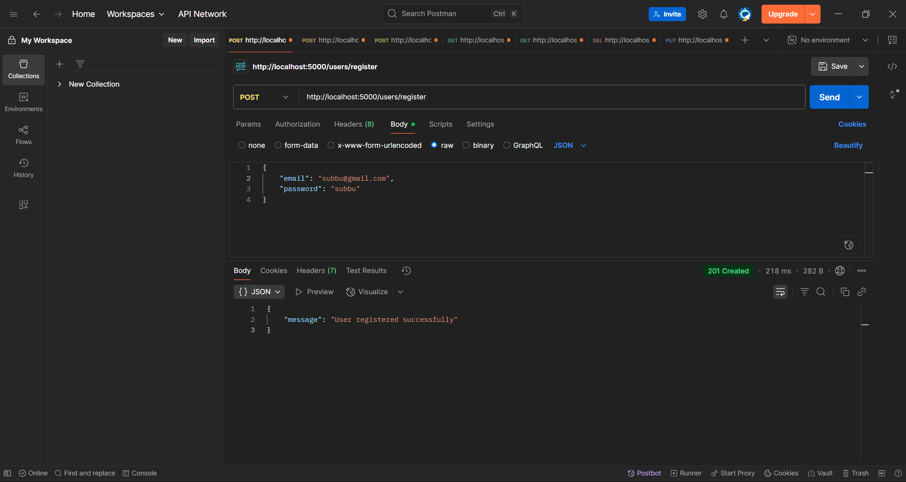
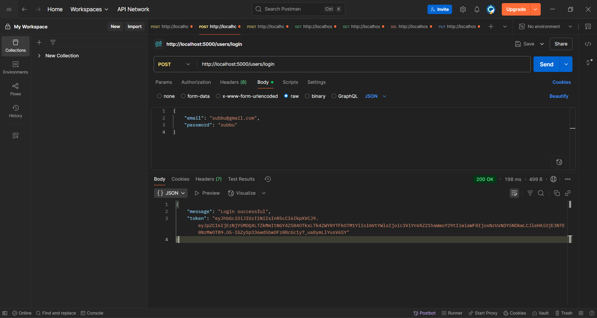
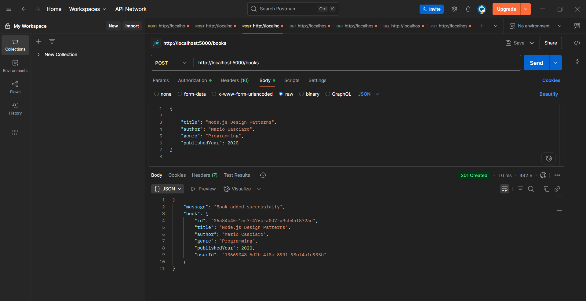
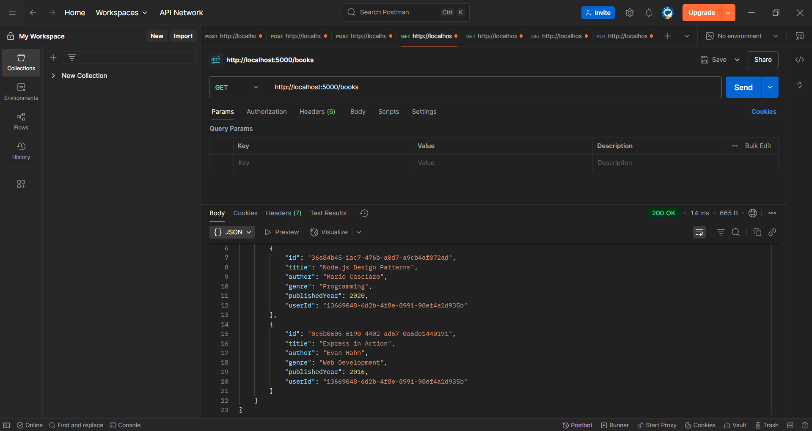
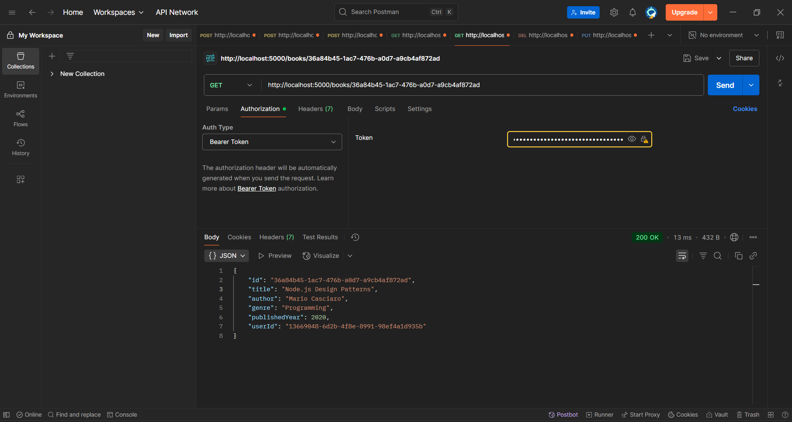
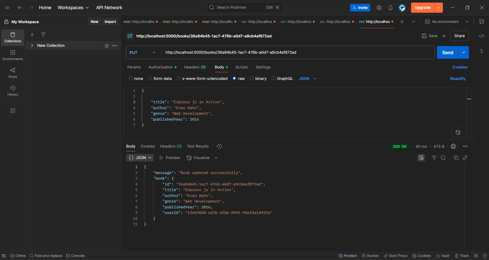
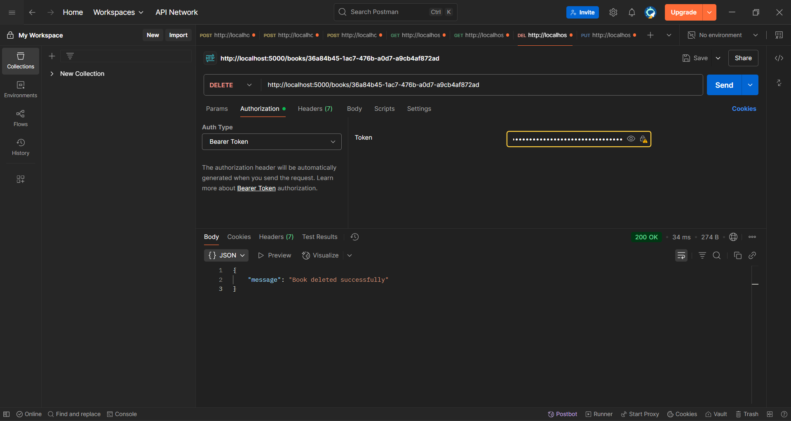

# 📚 Bookstore API

A simple REST API for managing books using **Node.js**, **Express**, and **JSON file storage**.

This app includes:

* 🔐 User Registration & Login
* 🛡️ JWT Authentication
* 📚 Book CRUD operations
* 🔍 Search by Genre
* 📄 Pagination
* 🧾 Token-based access control

---

## 🚀 Live URL (if hosted)

*Optional: Add this once deployed to services like Render, Railway, or Vercel.*

---

## 📬 API Endpoints (Ready for Postman)

**Base URL:** `http://localhost:5000`

---

## ✅ User Authentication

### 📝 Register

**POST** `/users/register`

**Request Body:**

```json
{
  "email": "subbu@gmail.com",
  "password": "subbu"
}
```

### 🔐 Login

**POST** `/users/login`

**Request Body:**

```json
{
  "email": "subbu@gmail.com",
  "password": "subbu"
}
```

**Response Example:**

```json
{
  "message": "Login successful",
  "token": "<JWT_TOKEN_HERE>"
}
```

Copy the token and use it in the **Authorization header** for all `/books` routes:

```
Authorization: Bearer <token>
```

---

## 📚 Book Routes (Protected with JWT)

*All routes below require an auth token.*

### ➕ Add Book

**POST** `/books`

**Headers:**

```
Authorization: Bearer <token>
```

**Request Body:**

```json
{
  "title": "Node.js Design Patterns",
  "author": "Mario Casciaro",
  "genre": "Programming",
  "publishedYear": 2020
}
```

---

### 📚 Get All Books (with Pagination)

**GET** `/books?page=1&limit=5`

**Response:**

```json
{
  "total": 2,
  "page": 1,
  "limit": 5,
  "books": [
    {
      "id": "36a84b45-1ac7-476b-a0d7-a9cb4af872ad",
      "title": "Node.js Design Patterns",
      "author": "Mario Casciaro",
      "genre": "Programming",
      "publishedYear": 2020,
      "userId": "13669048-6d2b-4f8e-8991-98ef4a1d935b"
    }
  ]
}
```

---

### 🔍 Search Books by Genre

**GET** `/books/search?genre=Programming`

---

### 📖 Get Book by ID

**GET** `/books/:id`
*Example:* `/books/36a84b45-1ac7-476b-a0d7-a9cb4af872ad`

---

### ✏️ Update Book

**PUT** `/books/:id`

**Headers:**

```
Authorization: Bearer <token>
```

**Request Body:**

```json
{
  "title": "Node Design Patterns",
  "author": "Mario Casciaro",
  "genre": "Programming",
  "publishedYear": 2021
}
```

---

### 🗑️ Delete Book

**DELETE** `/books/:id`

**Headers:**

```
Authorization: Bearer <token>
```

---

## 🛠 Setup Instructions

### 🔁 Clone the Repository

```bash
git clone https://github.com/subramanyamchoda/bookstore-api.git
cd bookstore-api
```

### 📦 Install Dependencies

```bash
npm install
```

### 🔐 Environment Variables

Create a `.env` file in the root directory:

```ini
SECRET_KEY=your_secret_key_here
PORT=5000
```

### ▶️ Run the Server

```bash
npm start
```

API will be running at:
👉 `http://localhost:5000`

---

## 🛠 Tech Stack

* Node.js
* Express.js
* JWT (jsonwebtoken)
* bcryptjs
* uuid
* File system (JSON file storage)
* Postman (API testing)

---

## ✅ Features

* 🔒 Secure User Registration & Login
* 🛡 JWT-based Protected Routes
* 📚 Full Book Management (Create, Read, Update, Delete)
* 🔍 Search Books by Genre
* 📃 Pagination for Book Listings
* 👤 Only the user who created a book can update/delete it

---

## 📸 Postman Testing Screenshots

| Register                                     | Login                                     |
| -------------------------------------------- | ----------------------------------------- |
|  |  |

| Add Book                                    | Get All Books                                   |
| ------------------------------------------- | ----------------------------------------------- |
|  |  |

| Single Book                                    | Update Book                                    | Delete Book                                    |
| ---------------------------------------------- | ---------------------------------------------- | ---------------------------------------------- |
|  |  |  |

---

## 🙌 Author

**Subramanyam Choda**
📧 [Email](mailto:your-email@example.com)
🌐 [GitHub](https://github.com/subramanyamchoda)
